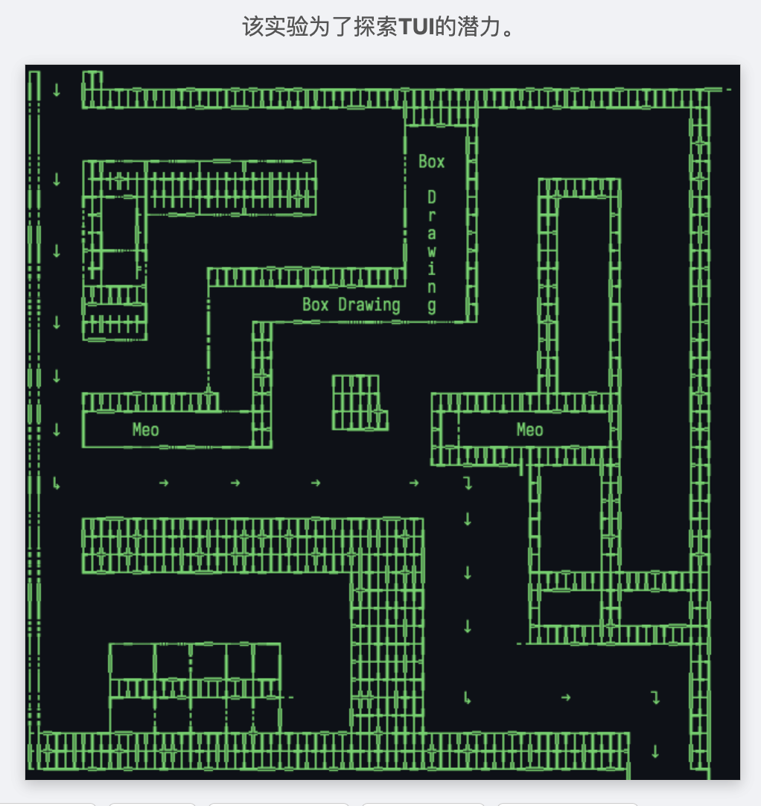

# Pixel-Principled Box Drawing · 基于像素原理的制表符绘图

在线预览（GitHub Pages）
- https://meomeo-dev.github.io/html_tui_box_drawing/



本项目是一个纯前端、零依赖的实验性 TUI/ASCII 绘图工具。它在 `<canvas>` 上以等宽字体渲染 Box Drawing 字符集（U+2500–U+257F），并通过离屏采样字符的“像素触边”来判断上下左右连通性，绘制时自动选择最匹配的字符（细线/粗线/双线等），使笔画在视觉像素层面真正连贯。

## 功能特性
- 像素连通性驱动：离屏采样字符边缘像素，基于实际渲染结果决定连通掩码（UP/DOWN/LEFT/RIGHT）。
- 自动字符挑选：根据邻接需求掩码，从候选字符集中精确或“最小超集”匹配，保证连接自然且随机化风格（细/粗/双线等）。
- 工具与模式：
  - 绘制、橡皮擦、清空
  - 文本模式（将任意字符直接放入格子并锁定，不会被自动替换）
  - 十字辅助线与斜线辅助（带角度滑块，Bresenham 栅格走线）
- 文本导出：将当前网格导出为纯文本（未填充格为空格）并复制到剪贴板。
- 种子图案：加载时自动播种默认图案，便于探索效果。
- 纯静态：单个 `index.html`，无需构建与依赖，浏览器本地打开即可使用。

## 使用方法
- 在线版：直接访问 https://meomeo-dev.github.io/html_tui_box_drawing/
- 本地打开：双击/拖拽 `index.html` 到浏览器即可。
  - 复制到剪贴板在非安全上下文下可能受限，页面已内置回退方案（临时 `<textarea>`）。

## 交互说明
- 鼠标
  - 拖动绘制：按住并拖动以连续绘制；在橡皮擦模式下则为连续擦除。
  - 十字辅助线：开启后显示当前格的十字参考线；按首次位移方向自动水平/垂直锁定。
  - 斜线辅助：指定角度（0–180°），沿通过起点的角度线进行栅格吸附，使用 Bresenham 离散。
- 按钮
  - 清空画布、复制文本、橡皮擦、文本模式、辅助线、斜线辅助、角度滑块
- 键盘（文本模式下）
  - 直接输入任意可见字符：放入当前选中格并锁定
  - Backspace/Delete：删除该格
  - Esc：取消选中

## 工作原理（简要）

> Vibe Coding, 用于验证产品功能概念, 未核验算法正确性. 

- 字符像素掩码：在离屏 `<canvas>` 上以等宽字体渲染候选字符，采样靠近四边的 2px 条带，统计 `alpha` 占比，超过阈值即视为该边“触边”，从而得到 4 位掩码（UP/DOWN/LEFT/RIGHT）。
- 动态选字：对某格，先根据“邻居存在/指向本格”的需求拼出目标掩码；优先精确匹配，否则在掩码超集里选择“多余边”最少的一组并随机挑一个字符。
- 连续绘制：水平/垂直用区间填充；斜线采用 Bresenham 算法离散经过的格子。
- 覆盖层：使用第二个 `<canvas>` 绘制十字/角度引导与选中高亮，避免影响主画布像素。

## 目录结构
```
.
├── index.html        # 单文件应用（UI、逻辑、样式均在此）
├── .github/workflows/deploy-pages.yml  # GitHub Pages 部署工作流
├── .nojekyll         # 关闭 Jekyll，确保下划线路径可用
├── .gitignore
└── LICENSE
```

## 部署
- 已配置 GitHub Actions，推送到 `main` 分支将自动部署到 Pages。
- 如将来加入构建步骤并把产物输出到子目录（例如 `dist/`），请将工作流中的：
  ```yaml
  # .github/workflows/deploy-pages.yml
  - name: Upload artifact
    uses: actions/upload-pages-artifact@v3
    with:
      path: '.'   # 若使用构建产物，请改为 'dist'
  ```

## 许可证
- 详见仓库中的 `LICENSE` 文件。
